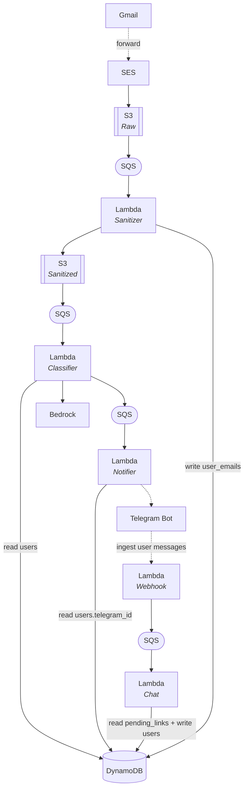

# needl.email

## Setup (Manual — not in Terraform)

> ⚠️ These setup steps are performed manually in the AWS Console. Terraform does not currently configure SES receiving rules.

### 1. **Create an S3 Bucket**

- Go to **S3 → Create bucket**
- Name it something like `needl-email-inbox`
- Leave most settings as default, but ensure **Block all public access is enabled**

### 2. **Create an IAM Role for SES**

- Go to **IAM → Roles → Create role**
- Choose **SES** as the trusted service
- Attach the **AmazonS3FullAccess** policy (or create a minimal policy scoped to your bucket)
- Name the role something like `SESToS3WriteRole`
- Save the Role ARN — you’ll need it in the SES rule setup

### 3. **Create an SES Rule Set**

- Go to **SES → Email Receiving → Rule Sets**
- Create a new rule set

### 4. **Add a Rule to the Rule Set**

- Add a new rule with the following:
  - **Recipients**: leave blank for all emails or specify (e.g., `@yourdomain.com`)
  - **Actions**:
    - Choose **S3**
    - Select the **S3 bucket** you created earlier (e.g., `needl-email-inbox`)
    - Use the IAM **role** you created that grants SES write permissions

### 5. **Activate the Rule Set**

- Make sure the rule set is **activated** so SES begins processing email

### 6. **Update Route 53 with an MX Record**

- Go to **Route 53 → Hosted Zones → yourdomain.com**
- Create an **MX** record: `10 inbound-smtp.us-east-1.amazonaws.com.`
  
### 7. **Send a Test Email**

- Send an email to your domain (e.g., `test@yourdomain.com`)
- Confirm the email appears in the S3 bucket 

## Architecture

